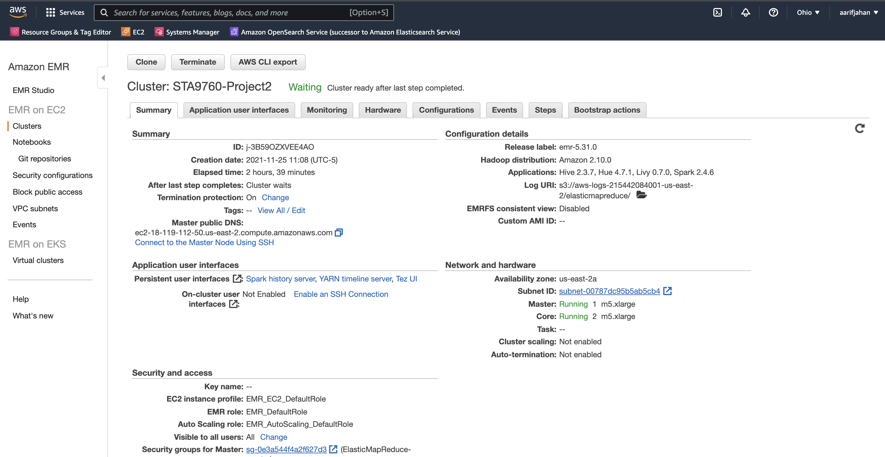
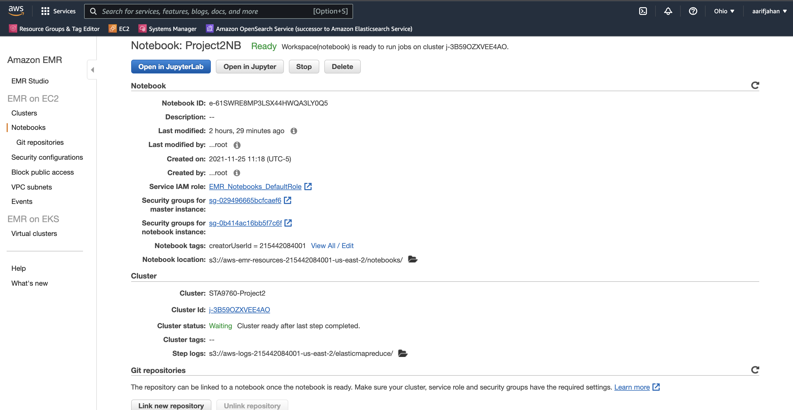

# Analyzing 10Gb of Yelp Reviews Data

Access 10 GB of Yelp Reviews data stored in AWS S3 bucket and then use PySpark on a Jupyter Notebook hosted on a AWS EMR Cluster to analyze and create effective visualizations

In this project, we will analyze a subset of Yelp's business, reviews and user data. This dataset comes to us from [Kaggle](https://www.kaggle.com/yelp-dataset/yelp-dataset) stored in an AWS s3 bucket: `s3://sta9760-spark-yelp1/*.json`

## Analysis

The analysis is performed using a jupyter notebook file running on a AWS EMR cluster. We utilize the powerful library of PySpark to ingest, slice and dice and analyze millions of rows of data stored in AWS S3 bucket within seconds. 

The analysis starts from data exploration from the input json files which are then used to answer questions such as:

1. What are the top 20 business categories with most reviews?
2. Do Yelp reviews skew negative in general?
3. Can reviews from elite Yelp uses be trusted to judge a business?
4. What are some underlying trends with Yelp users?
5. What are the top 5 states with most Yelp reviews?

The Analysis.ipynb jupyter notebook file contains all the code and outputs for this project.

## Cluster and Notebook Configs

-- Aarif M Jahan -- Nov 25, 2021

